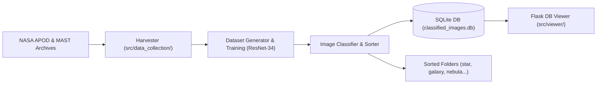

# `nasa-image-training`

> *"Initializing deep space observation pipeline..."*  
> `[OK] NASA & MAST APIs authenticated.`  
> `[OK] ResNet-34 neural backbone loaded.`  
> `[OK] Ready for classification.`  

Welcome to **nasa-image-training**! This repository hosts an end-to-end Deep Learning and Computer Vision pipeline designed to collect, process, train, classify, and visualize astronomical imagery from NASA and the Mikulski Archive for Space Telescopes (MAST). Using a custom fine-tuned ResNet-34 convolutional neural network, the system automatically categorizes deep space captures into five astrophysical classes: **stars**, **galaxies**, **quasars**, **nebulae**, and **planets**.



---

### `/usr/bin/features`

Here is a quick look at the core components and modules contained in this workspace:

| Module | Architecture & Tools | Key Features |
| :--- | :--- | :--- |
| **[Image Harvester](src/data_collection/image_collection.py)**<br><br>   | **Astroquery & Requests**<br>Endpoints: NASA APOD, MAST HST Science Catalog | Automated batch downloader with keyword filtering, fast MJD window queries, deduplication registries, and high-resolution asset acquisition. |
| **[Dataset & Model Training](training/network_training.ipynb)**<br><br>   | **ResNet-34 Transfer Learning**<br>Optimizer: `Adam` (lr=1e-4), Loss: `CrossEntropy` | Custom PyTorch `Dataset` with geometric augmentations (random flips, 180° rotations, normalization), AMP (`autocast` / `GradScaler`), and test evaluation. |
| **[Classifier & Auto-Sorter](network_sorting/image_classifier.ipynb)**<br><br>  | **Inference Engine & SQLite Logger**<br>DB: `network_sorting/classified_images.db` | Scans raw image directories, runs batch inference, automatically moves files to class-specific folders, and logs full audit metadata to SQLite. |
| **[Classification Viewer](src/viewer/classification_viewer.py)**<br><br>  | **Flask Lightweight Server**<br>Template: `src/viewer/templates/index.html` | Clean, CSS-free semantic HTML viewer displaying per-category breakdown tables (stars, planets, galaxies, etc.) with record counts and quick jump links. |

---

### `/usr/bin/pipeline`

#### 1. Data Harvester (`src/data_collection/image_collection.py`)
Downloads high-resolution astronomical targets across two complementary data sources:
* **NASA Astronomy Picture of the Day (APOD):** Queries the NASA API with keyword matching (`galaxy`, `nebula`, `planet`, `cluster`, `hubble`, `webb`, etc.).
* **Mikulski Archive for Space Telescopes (MAST):** Fast-queries Hubble Space Telescope (HST) science observation products with automated product filtering and JSON progress registries.

#### 2. Deep Learning Training (`training/`)
* **Backbone:** ResNet-34 pre-trained on ImageNet, adapted with a 5-class linear output head.
* **Augmentations:** Normalization matching ImageNet distribution, horizontal flipping, and rotational invariance suitable for space imagery.
* **Acceleration:** Native PyTorch Automatic Mixed Precision (`torch.amp.autocast`) for high-throughput GPU training.

#### 3. Automated Sorter & SQLite Logger (`network_sorting/`)
* Feeds raw imagery through the trained model weights (`trained_net.pth`).
* Categorizes each image into its respective destination folder (`network_sorting/<predicted_class>/`).
* Records execution metadata (`filename`, `source_directory`, `predicted_class`, `destination_path`, `timestamp`) into an SQLite database (`classified_images.db`).

#### 4. Web Classification Viewer (`src/viewer/classification_viewer.py`)
* Lightweight Flask application serving a pure, semantic HTML interface without external CSS dependencies.
* Automatically groups records by astrophysical classification, generating isolated tables for stars, planets, galaxies, nebulae, and quasars.

---

### `/var/log/classes`

The model classifies astronomical objects into five primary categories:

| Target Class | Astronomical Description | Example Targets |
| :--- | :--- | :--- |
| **`star`** | Single stars, stellar fields, globular clusters, open clusters, and star trails. | *Pleiades, Eta Aquaridy, 47 Tucanae* |
| **`galaxy`** | Spiral, elliptical, irregular, and merging galaxies or deep galaxy clusters. | *M81, M82, NGC 3628, Hoag's Object* |
| **`nebula`** | Emission, reflection, planetary nebulae, supernova remnants, and dark dust clouds. | *Crab Nebula, Horsehead Nebula, Tarantula* |
| **`planet`** | Solar system planets, planetary moons, ring systems, and planetary surface details. | *Jupiter, Mars, Rhea, Titan Lakes* |
| **`quasar`** | Active galactic nuclei, distant energetic pulsars, and high-energy radio sources. | *Vela Pulsar, Abell 2744* |

---

### `make run`

#### 1. Clone & Prepare Environment
```bash
# Clone the repository
git clone https://github.com/RaulSalasSahuquillo/nasa-image-training.git
cd nasa-image-training

# Create and activate virtual environment
python3 -m venv .venv
source .venv/bin/activate

# Install dependencies
pip install -r requirements.txt
```

#### 2. Configure API Keys
Copy the example environment file and configure your [NASA API Key](https://api.nasa.gov/):
```bash
cp .env.example .env
# Edit .env and replace DEMO_KEY with your personal key if available
```

#### 3. Harvest Images (Optional)
```bash
python src/data_collection/image_collection.py
```

#### 4. Train Model or Run Classifier
Open the interactive notebooks in Jupyter or VS Code:
* `training/network_training.ipynb` — Train the ResNet-34 model and export `trained_net.pth`.
* `network_sorting/image_classifier.ipynb` — Run inference and populate `classified_images.db`.

#### 5. Launch Classification Web Viewer
```bash
python src/viewer/classification_viewer.py
```
Then navigate to **`http://localhost:5000`** in your browser.

---

*"In a universe of billions of galaxies, make some code-guided discoveries."*

---

## License

This project is licensed under the **Creative Commons Attribution-NonCommercial-ShareAlike 4.0 International** (CC BY-NC-SA 4.0) license.

[](https://creativecommons.org/licenses/by-nc-sa/4.0/)

### Summary of Terms:
* **Attribution:** You must give appropriate credit to **Raúl Salas Sahuquillo** and provide a link to the original repository.
* **Non-Commercial:** You may not use this work, its code, or trained model weights for commercial purposes without explicit written consent.
* **ShareAlike:** If you adapt or build upon this repository, your modifications must be shared under the same license.